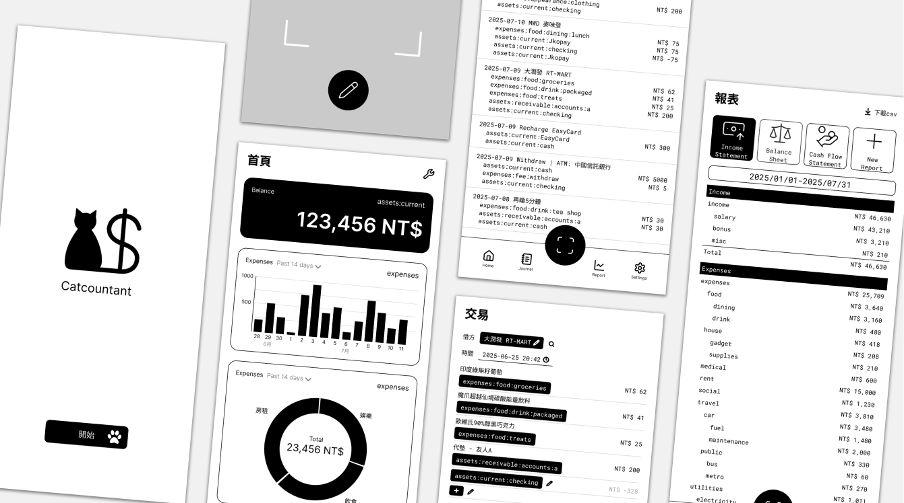

<h1 align="center">
  <br>
  
  <br>
  Catcountants
  <br>
</h1>

<h4 align="center">A double-entry bookkeeping app built for personal use.</h4>

<p align="center">
  <a href="#key-features">Key Features</a> •
  <a href="#getting-started">Getting Started</a> •
  <a href="https://www.figma.com/design/9RODrR6UY7w49wn8Q12imY">Figma</a> •
  <a href="https://drive.google.com/drive/folders/1TSTk7ukGGgnBFH28zKms5BTVSisxDqba?usp=drive_link">Google Drive</a> •
  <a href="https://docs.google.com/presentation/d/1smzG3CD_uTbKi67ZpyjRgITBt_G7QG1jX68wWC6rT4k">Slides</a>
</p>



## Key Features

* Automatic transction entry
  - Scan receipts and enter items and accounts for you
* Supports plain text accounting
  - Reads and exports to ledger-cli format, never fear losing your journal

## Getting Started

Currently, only a tech demo is available, demonstrating the ability to scan receipts and give personal account suggestions based on past journal entries.

```bash
# Clone this repository
$ git clone https://github.com/fast-ledger/fast-ledger

# Go into the repository
$ cd fast-ledger

# Install poetry
$ python -m pip install pipx
$ pipx install poetry
$ pipx ensurepath

# Install dependencies
$ poetry init
$ poetry install
```

To execute the tech demo, run the following command:

```bash
$ python src/app/Tech Demo/demo.py
```

If you're using VS Code, you can go to `Run and Debug` tab, select `Inspect Tech Demo App`, and run `Start Debugging`.